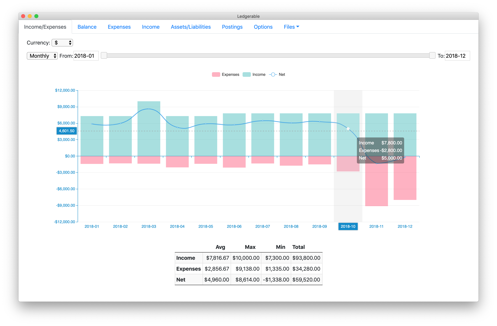
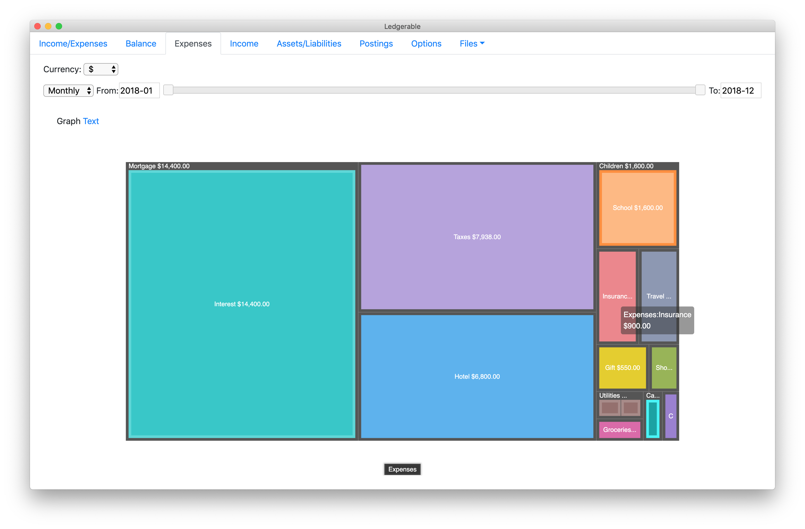
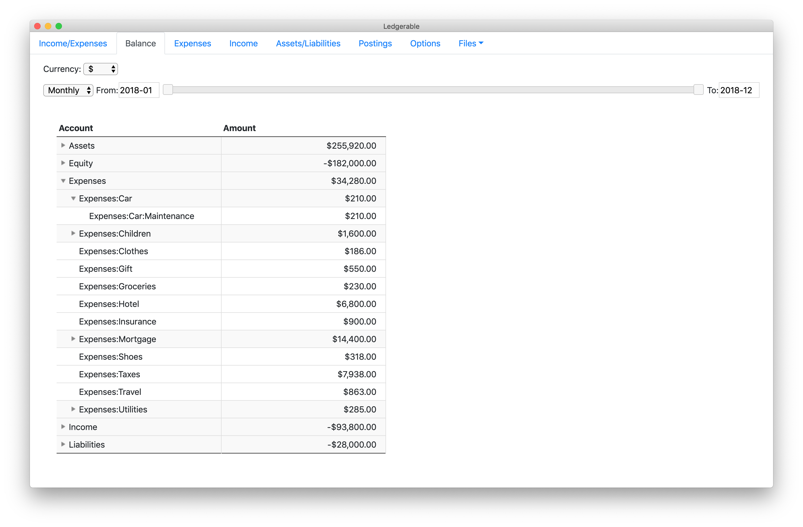

# ledgerble

A ui for [ledger-cli](https://www.ledger-cli.org/) files

# Installation

First install [ledger-cli](https://www.ledger-cli.org/) and [npm](https://www.npmjs.com/get-npm).  

When those are installed, install ledgerble using the command,

    npm install -g ledgerble

After this, you can type `ledgerble` to start.

After starting, use the "Files" menu to select and open your ledger file.

# Screenshots

